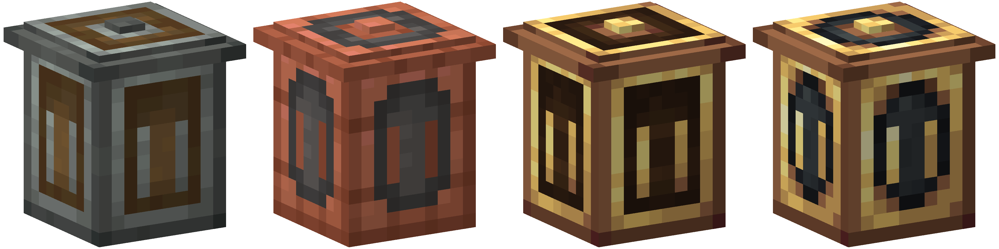

---

#### Makes the [Trash Cans Mod](https://modrinth.com/mod/trash-cans) look More out of [Create mod!](https://modrinth.com/mod/create)!

---

Create Trash Cans retextures every asset in the Trash Cans Mod to fit more into the Create Mod. This supports 1.20.1 and 1.21.1. I do not plan on adding support to 1.19/before, but it still may work on those versions.

#### If you encounter any bugs or have a suggestion, please report it on my [Github page](https://github.com/Rustic-Potatoes/create-trash-cans).

---

#### Links:

- Curseforge: [Create Trash Cans](https://www.curseforge.com/minecraft/texture-packs/create-trash-cans)

---
